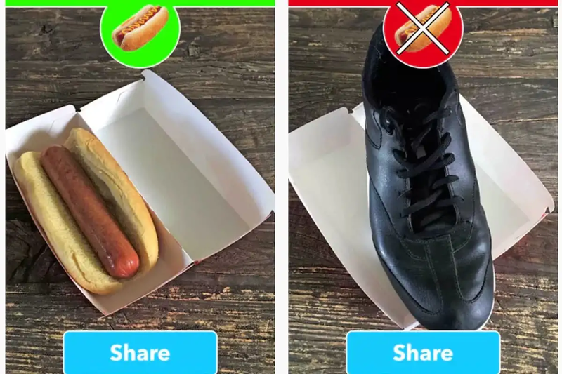

+++
title = "Building another \"Not Hot Dog App\" using PyTorch: FastAI 1.0 Baseline + Demo"
#description = "This is a showcase post."
date = 2018-11-03T00:00:00Z
#updated = 2022-11-10
#weight = 0
#slug = "future post"
#path = "/launch"
#draft = true

[taxonomies]
tags = ["fast.ai", "deep learning", "project", "pytorch", "mobile", "computer vision"]

[extra]
ToC = true
+++

**By [Sanyam Bhutani](https://twitter.com/bhutanisanyam1) and Cedric Chee**

_(Part 1 of the blog series to document the creation of another "Not Hot Dog" App using PyTorch.)_

This post serves as an introduction to Transfer Learning as well as a few key points that I've learnt are good for building a baseline for a Machine Learning model. I'll also introduce a crazy idea of building and porting an idea to an app with PyTorch as the main framework. This will be a 3 part series to document and share our success or failure of a re-build of the "Not Hot Dog App"

This is Part 1 of the series where I'll share how we're (We refers to a group of students from the FastAI community) building a tiny ML app.

We're replicating results by [Tim Anglade](https://medium.com/u/9e65cb0685de), who had built the original app for the TV Series: Silicon Valley.

Fun fact: Tim is also a FastAI Student so we're confident that we'd be able to achieve a good result.

Here is our three-step game plan:

- Build a good prototype model baseline. (Prototype)
- Port the baseline to a mobile-friendly architecture. (Production ready model)
- Port the architecture into an app. (Put the architecture to production)

For Step 1, we're using FastAI to build a classifier baseline.

This is the easiest part since it's just fine-tuning the model for a quick few steps and that should provide us with a solid baseline result.

So, the first question is why are we trying to re-build an app in a framework that's not the best choice for Mobile deployment?

We're actually trying to use this experiment as a testing ground for an "app idea". Now, since FastAI is my favorite framework and PyTorch follows automatically, this experiment will help us and hopefully, you, understand how hard/easy/wise/stupid it is to try and put a PyTorch model into a mobile environment.

The other reason for doing it, what better way to kill a weekend than build a HotDog or NotHotDog App?

---

## The Baseline

### Dataset

For our little experiment, we've decided to use [this dataset](https://www.kaggle.com/dansbecker/hot-dog-not-hot-dog/home) curated by Dan Becker, hosted at kaggle.

After basic inspection, the dataset looks like a good start and has 250 images per-label, which would allow us to perform transfer learning on these images.

### Transfer Learning

The best and quickest way to achieve a baseline here is to simply use a "pre-trained" network and then "fine-tune" it to our dataset. The images are derived or similar to ImageNet so "Fine-tuning" should work well.

**What is a Pre-trained Network?**

Let's for the sake of explanation consider our "Model" to be a three-year-old kid's brain.

We have a smart and curious kid-we're teaching him how to recognize objects in images. The kid here is the model and the task is ImageNet Challenge. The expert refers to the research groups that train the model to perform well on the Leader board.

**What is Fine Tuning?**

Now we have our "educated kid", who is good at ImageNet.

Now, We give him our simple task: Name if the image is a not hot dog image.

Fine tuning: The process of taking our "smart kid" or model that performs well at ImageNet Challenge and then re-training him or giving it a quick training to a new category of images that are similar to what he is good at.

**Why Fine-Tuning?**

- Faster: Its faster than training a Neural net from scratch.
    
    If some expert has spent their time to train the smart kid. We can just teach the smart kid a new task that he is already good at.
- Efficient:

    As previously mentioned, the kid is smart. Smart in the sense that he is good at the ImageNet Challenge. So obviously, he would do good on similar challenges. Or at least we'd hope so.

### Transfer Learning in FastAI

This section will just be a quick walkthrough of performing Transfer Learning in FastAI for our use-case.

This is just an attempt to explain what is happening here. For a much clear explanation, please check out our Guru's (Jeremy Howard's) fast.ai MOOC's V3 which comes out in 2019.

For our "baseline", we're testing a kid named ResNet34

**What is a baseline result?**

When you're working with a ML idea, it's easy to get lost into the complications and keep building without having a good result until a long time.

The approach suggested by Jeremy, in the [fast.ai ML MOOC](https://course.fast.ai/ml.html): build a baseline as fast as possible, and then build on top of it.

The baseline result is the fastest result of an acceptable "accuracy" for our experiment.

Accuracy here refers to how accurately the "kid" (Model) recognises the given image as not being a hot dog.

**NotHotDog Baseline**

- Since the data is already separated into two folders, fast.ai supports this "ImageNet" like data and we can create our data model right away.

{{ image(src="jupyter-nb.png",
         position="center",
         style="width: 90%") }}

- We download our kid's brain: ResNet34-Pretrained Weights.
- We let the model run for 38 seconds and finally we have a model with 87% accuracy.
- Why is this important?

    In under a day-we have an idea of what should be a good or possible accuracy given our problem.
- How good is 87%?

{{ image(src="jupyter-nb-results.png",
         position="center",
         style="width: 90%") }}

- The first and third images and final images are confusing obviously, so there are some faults in the data.
- We've decided that this is a good enough baseline and we can move onto step 2.
- For the next blog, I'll share the steps required to port this model onto a mobile.
- Why do I think 87% is good?

    We actually have to use a "Mobile friendly" architecture so that we can run inference on the mobile phone, which means the training wheels and power of ResNet 34 won't be there and if we're using SqueezeNet or MobileNet-87% would be a good mark to hit.

## What's Next?

[Cedric Chee](https://medium.com/u/979552fb320d), who is another fast.ai International Fellow in our Asia virtual study group and fellow student in the fast.ai community has developed the major portions required for Step 2 and 3 of our pipeline. Please checkout the mobile app demo:

{{ youtube(id="TYkoaVNCMos", autoplay=false, class="youtube") }}

Jupyter notebooks that will walk you through every step:

[cedrickchee/data-science-notebooks](https://github.com/cedrickchee/data-science-notebooks/blob/master/notebooks/deep_learning/fastai_mobile/README.md)

We'd want to use SqueezeNet/MobileNet-whatever works better eventually and make it run on the mobile.

PS: Tim Anglade, please wish us luck. We'll bring your Emmy home this time 😎

_Originally published at [Medium](https://medium.com/@init_27/anothernothotdog-280ee5b86fb3)_
