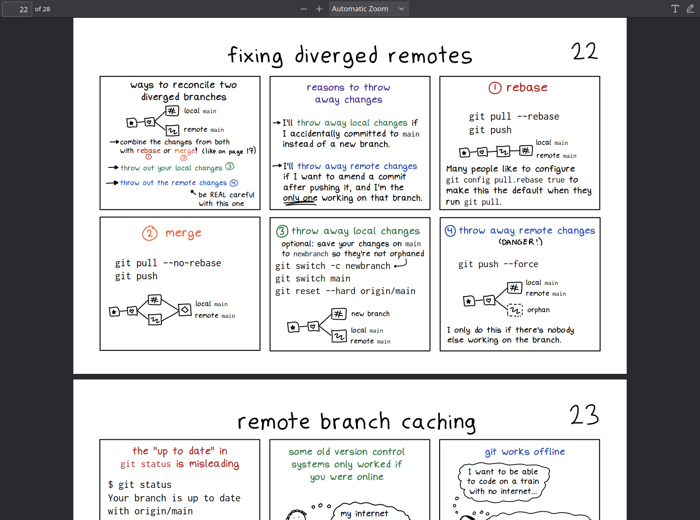

+++
title = "How Git Works"
description = "It sucks to be afraid of the tools that you use in your work every day."
date = 2024-06-04T00:00:00Z
#updated = 2022-11-10
#weight = 0
#slug = "future post"
#path = "/launch"
#draft = true

[taxonomies]
tags = ["git"]

[extra]
ToC = false
+++

I have been using git for years and are still afraid of it. It sucks to be afraid of the tools that you use in your work every day. So, I will upgrade my git knowledge and skills whenever I can.

The timing is good. [Julia Evans](https://jvns.ca/)'s Git zine just came out. I got a copy of it. I enjoy reading it.

Here's the cover:

## TIL (Today I Learned) [^1]

Today, I want to share some TILs below.

#### Combining diverged branches

When merging branches, I often run into diverged branchs situation.

This is good; the little diagrams help illustrate rebasing vs. merging, one of the tricker parts of the git learning curve.

#### Fixing diverged remotes

This is one thing I struggle with git when I work with remotes. My team members and I will encounter diverged remotes situation when working with a git remotes hosted on GitHub or GitLab.

This is one part of git that seem scary (losing your work) are pretty straightforward to deal with once you understand what's going on.

## The cheat sheet

The zine also comes with a free cheat sheet. You can download it [here](https://wizardzines.com/git-cheat-sheet.pdf) (PDF).

---

I've been following Julia's work and blog for a long time. The git zine is part of Wizard Zines.

[^1]: [/r/TodayILearned](https://old.reddit.com/r/todayilearned/)
