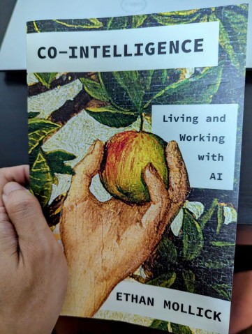
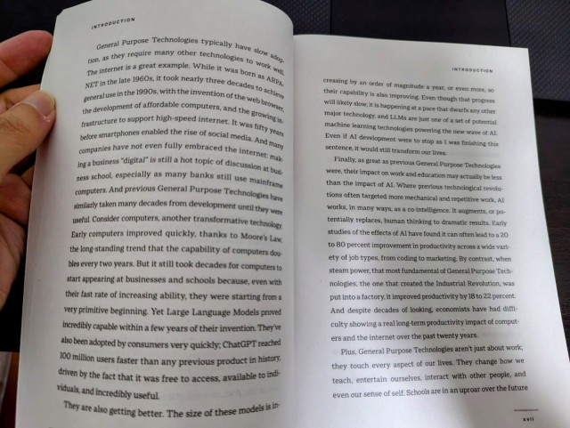

+++
title = "Co-Intelligence: Living and Working with AI - A Book Review"
description = "📚 I recently finished \"Co-Intelligence\" by Ethan Mollick. Is it the Gen AI guidebook you've been waiting for? 🚀 It's all about the sociological perspective of living and working with AI. A solid primer to AI for most readers, but not suited for those with advanced AI knowledge."
date = 2024-07-16T00:00:00Z
#updated = 2022-11-10
#weight = 0
#slug = "future post"
#path = "/launch"
#draft = true

[taxonomies]
tags = ["llm", "books", "ai"]

[extra]
ToC = true
+++

## In 200 Words

If you're just dipping your toes into the AI pool, Ethan Mollick's "[Co-Intelligence](https://www.penguinrandomhouse.com/books/741805/co-intelligence-by-ethan-mollick/)" is a solid starting point. But let's be clear — when we're talking AI here, we're really discussing the cutting-edge innovations: those Large Language Model (LLM) powered Generative AI applications that are creating buzz in the tech world.

| Book cover                                    | Sample pages                                  |
| :---                                          | :---                                          |
|  |  |

Now, if you're one of those tech wizards who's already delved into Transformer mechanics, explored the intricacies of LLMs, or pondered the implications of GPT's probabilistic nature, don't expect any groundbreaking revelations. This book isn't tailored for you.

I'll be candid — I picked up "Co-Intelligence" hoping for a deep dive into the "how do we coexist with AI" question. You know, something to challenge my perspective and preconceptions. Did it deliver? Well, partially. Mollick isn't shy about presenting speculative ideas, which I appreciate. However, I was hoping for more thought-provoking content — maybe even something controversial.

Ultimately, it's a worthwhile read. It's primarily aimed at non-technical individuals who want to feel more comfortable with Generative AI and LLMs without getting lost in technical jargon. If that's you, then it's certainly worth your time.

## Final Verdict

A solid introduction to Generative AI, but not suited for those with advanced technical knowledge.

---

## Longer Version

### Initial Impressions

I recently finished Ethan Mollick's "[Co-Intelligence](https://www.penguinrandomhouse.com/books/741805/co-intelligence-by-ethan-mollick/)", and it presents a mixed bag of insights. The first half essentially serves as Generative AI 101 for newcomers. If you've experimented with ChatGPT, you're unlikely to encounter any revelations here. Mollick attempts to distill Generative AI interaction into four principles, but it comes across as a combination of prompting tips and general observations. It's not exactly groundbreaking material.

### The Book's Strengths

However, the second part is where the book truly comes into its own. Mollick delves deep into how Generative AI is transforming the workplace, and this is where the book shines. He's not afraid to use his own work as a case study, demonstrating how Generative AI can be a game-changer. It's refreshing to see an author who practices what he preaches.

I must admit, much of Mollick's content resonated with me. He understands that AI isn't merely about task automation — it's potentially reshaping entire corporate structures. He's also astute in highlighting the risks of excessive reliance on AI-driven metrics.

### Highlights and Insights

In my opinion, the book's strongest section is Mollick's exploration of how AI is leveling the playing field between newcomers and veterans in the workplace. He goes beyond the typical "AI will enhance jobs, not replace them" rhetoric. Instead, he poses challenging questions about the implications for experienced workers whose expertise might be devalued. It's a sobering perspective, but an essential one to consider.

### Areas for Improvement

That said, Mollick falls short when it comes to providing advice on fostering an AI-friendly company culture. This section feels somewhat superficial, which is unfortunate given that it's a critical topic for managers in the current business landscape.

Mollick also explores potential changes in education and mentoring brought about by AI. He presents some intriguing ideas, such as AI serving as a versatile, always-available mentor. However, he also rightly cautions against over-reliance on such systems.

### Final Thoughts

What I particularly appreciate about this book is its focus on regular employees rather than just executives. It's refreshing to see AI discussed from the perspective of the average worker.

In conclusion, "Co-Intelligence" is a worthwhile read if you're trying to understand how AI might transform your work life. While it may not be perfect, and those well-versed in AI might find it somewhat basic, it serves as an excellent starting point for most readers. It effectively stimulates thought about the AI revolution that's rapidly approaching our workplaces.
